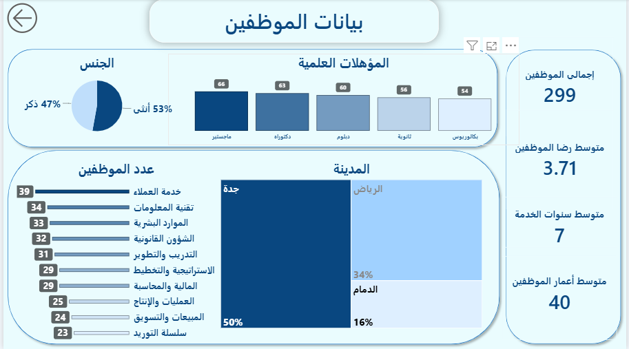
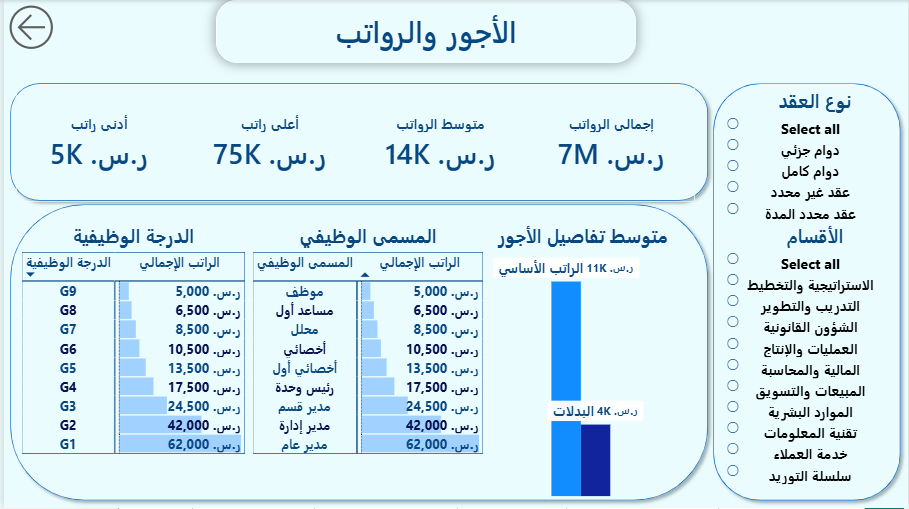
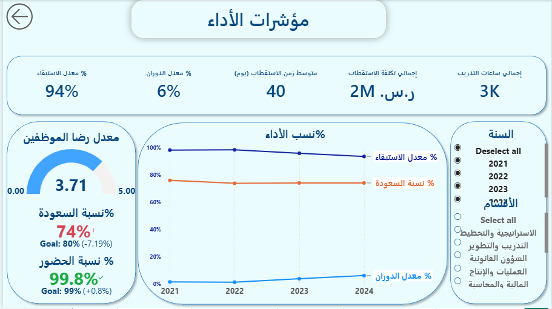
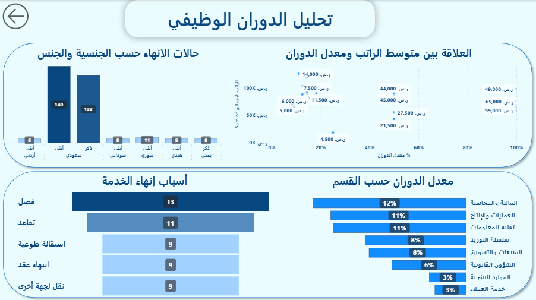
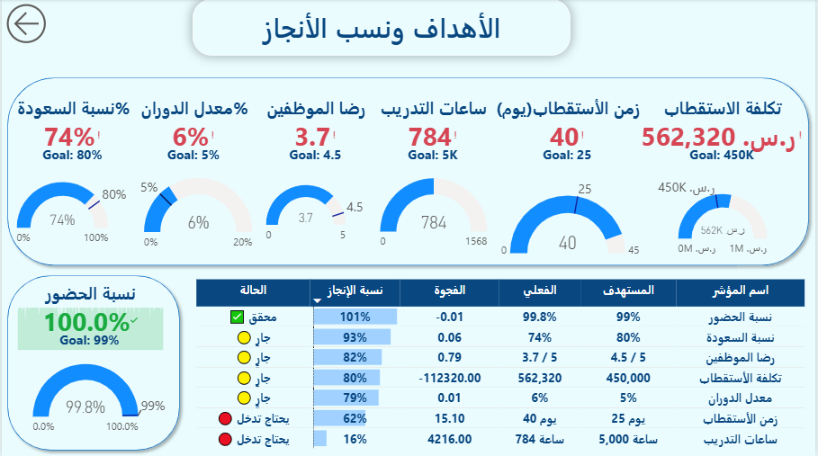

# 📊 لوحة تحكم الموارد البشرية والتخطيط الاستراتيجي
## HR & Strategic Planning Dashboard — Power BI

---

## 📌 نظرة عامة على المشروع
لوحة تحكم تفاعلية متكاملة مبنية على Power BI تغطي تحليل
بيانات الموارد البشرية والتخطيط الاستراتيجي لمنشأة افتراضية
تضم 350 موظفاً عبر 10 أقسام للفترة 2021-2024.

---

## 🗂️ اللوحات المضمّنة
| # | اللوحة | الوصف |
|---|--------|-------|
| 1 | بيانات الموظفين | التوزيع الديموغرافي، المؤهلات، المدن |
| 2 | الأجور والرواتب | كتلة الرواتب، الدرجات، المسميات |
| 3 | مؤشرات الأداء | الدوران، السعودة، الحضور، التدريب |
| 4 | تحليل الدوران | أسباب الإنهاء، التوزيع   |
| 5 | الأهداف ونسب الإنجاز | الفعلي vs الهدف، الفجوة، الحالة |

---

## 🛠️ الأدوات المستخدمة

- **Power BI Desktop** — بناء اللوحات 
- **DAX** — بناء المؤشرات والمعادلات
- **Excel** — مصدر البيانات (جداول وسجلات افتراضية)
- **Power Query** — تنظيف وتحضير البيانات

---

## 📐 المؤشرات الرئيسية المحسوبة بـ DAX

| المؤشر | الفعلي | الهدف | الحالة |
|--------|--------|-------|--------|
| نسبة السعودة | 74% | 80% | 🟡 جارٍ |
| معدل الدوران | 6% | 5% | 🟡 جارٍ |
| رضا الموظفين | 3.7/5 | 4.5/5 | 🟡 جارٍ |
| نسبة الحضور | 99.8% | 99% | ✅ محقق |
| زمن الاستقطاب | 40 يوم | 25 يوم | 🔴 يحتاج تدخل |
| ساعات التدريب | 784 | 5,000 | 🔴 يحتاج تدخل |
*جميع المؤشرات ديناميكية (تتغير بالسنة المحددة*)

---

## 📸 معاينة اللوحات

###   لوحة بيانات الموظفين

### لوحة تحليل الأجور

### لوحة مؤشرات HR

### لوحة الدوران الوظيفي

### لوحة الأهداف الاستراتيجية

---

## 📁 محتوى الملف
- `HR_Strategic_PowerBI` — ملف البيانات الكامل
- `Images` — صور جميع اللوحات
